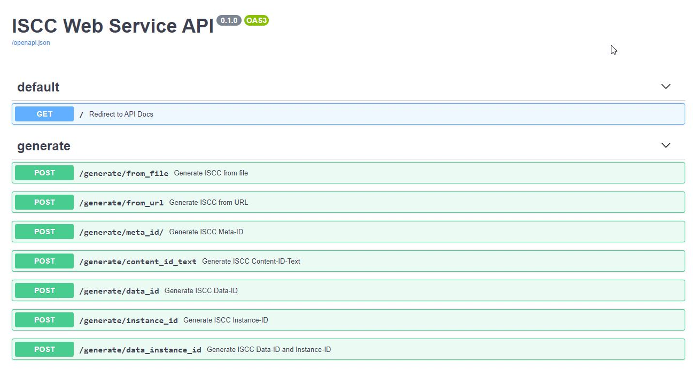

# iscc-service - ISCC Web Service API

[](https://hub.docker.com/r/titusz/iscc-service)

> A REST OpenAPI Backend for creating [**ISCC codes**](https://iscc.codes) for digital media files.


**Note**: This is work in progress. Use with care and at your own risk

The Webservice is build with [FastAPI](https://github.com/tiangolo/fastapi) and makes
use of the [ISCC reference implementation](<https://github.com/iscc/iscc-specs>) and
the [ISCC Command Line Tool](https://github.com/iscc/iscc-cli) and includes an
interactive API documentation:




The Docker image is published at https://hub.docker.com/r/titusz/iscc-service


## Setup for development

If you are using [poetry](https://python-poetry.org/):

- After checkout cd into code directory and run 'poetry install' to install dependencies.
- Launch dev server with: 'uvicorn iscc_service.main:app --reload'
- See API docs at: http://127.0.0.1:8000

## Publishing on Docker HUB:

```bash
docker login
docker build -t iscc-service -f Dockerfile .
docker run --rm -p 8080:8080 -it iscc-service
docker tag iscc-service username/iscc-service:0.1.1
docker push username/iscc-service:0.1.1
```
